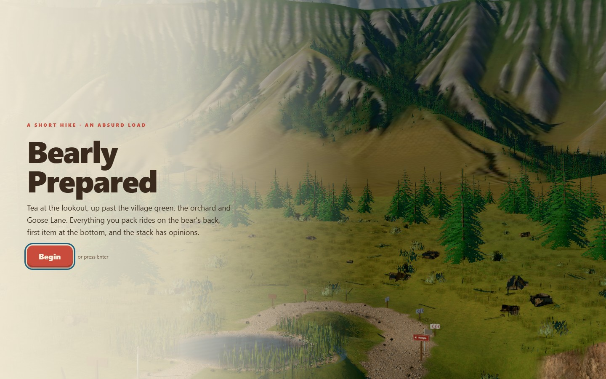
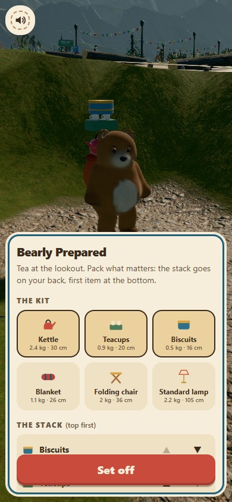
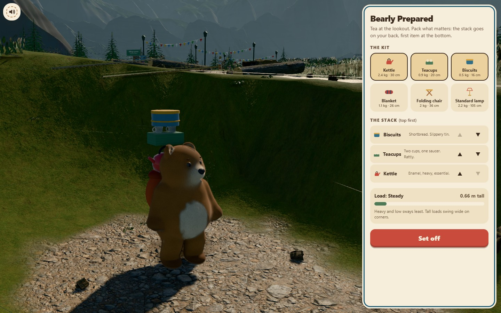

# BEARLY PREPARED

<p align="center"></p>

A bear packs a kettle, folding chair and standard lamp for a short hike. Keep the teetering stack together through a pond, hillside, fallen logs, distracted walkers, an orchard and a very cross goose. The reward is a civilised cup of tea above an alpine lake.

**[Pack for the hike →](https://06-bearly-prepared.williamking.workers.dev)** · [Run locally](#run-locally) · [Credits](#credits)

<p align="center"></p>

## Pack, balance, walk

The opening camera looks across the plateau and valley. Choose **Begin**, arrange the load and **Set off**. An action-led guide introduces walking, counter-leaning, steadying the stack and the first log; help can be revisited during the hike.

| Action | Keyboard | Pointer or touch |
| --- | --- | --- |
| Walk | Hold W or Up | Hold Walk |
| Jump | Space | Jump |
| Lean left / right | A/D or Left/Right | Hold the lean buttons |
| Pack, reorder or fetch | Tab and Enter through the controls | Item, reorder arrows or Fetch |
| Toggle sound | M | Sound |

When the load tilts right, lean left. Green on the gauge means the stack is settled, amber means a piece is slipping and red means a topple is close. Spilled items can be fetched; checkpoints preserve a recoverable load. Lean uphill on the camber, jump the logs, wait for gaps in the phone crowd and keep the stack clear of low orchard boughs.

## The bear and its world

- **Fur that gets wet.** A worker-built body wears layered shell fur. Wading darkens and clumps it, footsteps send out ripples, and the bear shakes off water after leaving the pond.
- **Weight in the walk.** Planted feet, bent knees, hip and shoulder motion and secondary springs respond to speed and load. Jumping, stumbling and falling have their own motion.
- **An alpine vista.** GPU-generated terrain, a path-traced sky and baked lighting put the trail above a lake, with forests, ridges, birds and local obstacles around the route.
- **A complete hike.** Packing, checkpoints, dropped items, recovery, the lookout and the tea ending are connected by the same balance simulation.
- **A smaller hardware budget.** Static scenery and crowds are batched. Quality tiers reduce fur and expensive passes; the renderer can reduce resolution when frame time stays high.

## Engineering and verification

Game rules in [src/game/](src/game/) are independent of the bear mesh. [src/scene/](src/scene/) owns the trail and animation, [src/ui/](src/ui/) the packing and hike controls, and [src/audio/](src/audio/) the score and cues. The [terrain-bake notes](tools/bake/README.md) explain the offline CUDA pipeline; its baked results ship with the game, so playing or developing the website does not require CUDA.

Application revision `4cd0e88` passed **106 tests / 1,500 assertions**, independent simulated trails, nine full-suite RTX 2060 scenarios and a final modal-recovery regression. These cover the full hike, jumps, checkpoint restoration, three touch sizes, held inputs, motion preferences and startup/runtime recovery. See the [bug-pass report](docs/visual/BUG-PASS-2026-09-30.md).

## Current screenshots

| Desktop | Phone |
| --- | --- |
|  |  |



The opening loop and three main screenshots were captured from the live site on **1 October 2026**, using Chrome on this workstation; the phone image is a 390 × 844 browser viewport. The animated preview is a short loop, not a full playthrough. [Capture details](docs/readme/capture.json).

## Run locally

Use **Bun 1.3.10** (the version pinned in `package.json`) and Node.js 22.12 or newer. From this repository:

```sh
bun install --frozen-lockfile
bun run dev      # http://127.0.0.1:4516/
bun run check    # strict types, Biome, unit tests and production build
bun run preview  # http://127.0.0.1:4616/ after the build
```

Development and preview are separate long-running commands; run one at a time or use separate terminals. `bun run build` writes the static production output to `dist/`. Dependencies and the lockfile are local to this project.

### Browser suite

Install the test browser once, then run the checked-in Playwright suite. Its configuration builds and starts the production preview. Browser scenarios are separate from `bun run check`.

```sh
bunx playwright install chromium
bun run e2e
```

The recorded real-GPU release checks used installed Chrome on an RTX 2060; the default Chromium configuration is not a claim of physical-phone coverage.

For the hardware path on Windows PowerShell, with Chrome installed:

```powershell
$env:E2E_GPU = '1'
$env:REQUIRE_REAL_GPU = '1'
bun run e2e
```

## Stack and release

Direct Three.js 0.186 · React 19.3 · strict TypeScript · Vite 8.3 · GSAP 3.15 · Tailwind CSS 4.3 · Bun 1.3.10 · Biome. The public website is served by Cloudflare Workers. This README describes [application revision 4cd0e88](https://github.com/WilliamHenryKing/06-bearly-prepared/commit/4cd0e88308ede8a756c9b4908fb1cf9cd52981bf); the documentation refresh changes no application behaviour.

## Credits

The bear, props, pond and trail are authored procedurally in this repository. Libraries: three.js, React, GSAP and Tailwind CSS, each under its own licence. Every sourced file is listed with its hash and processing in `assets.manifest.json`.

Visual assets (all CC0 1.0, from [Poly Haven](https://polyhaven.com)):

| Files | Source |
| --- | --- |
| `textures/grass_ground`, `rocky_trail`, `rock_face_03` | [grass ground](https://polyhaven.com/a/grass_ground), [rocky trail](https://polyhaven.com/a/rocky_trail), [rock face 03](https://polyhaven.com/a/rock_face_03) |
| `textures/bark_brown_02`, `distressed_painted_planks`, `hessian_230`, `wool_boucle` | [bark brown 02](https://polyhaven.com/a/bark_brown_02), [distressed painted planks](https://polyhaven.com/a/distressed_painted_planks), [hessian 230](https://polyhaven.com/a/hessian_230), [wool boucle](https://polyhaven.com/a/wool_boucle) |
| `textures/grass_medium_02` and `shrub_02` card atlases | [grass medium 02](https://polyhaven.com/a/grass_medium_02), [shrub 02](https://polyhaven.com/a/shrub_02) |
| `models/rock_moss_set_01.glb`, `models/dandelion_01.glb` | [rock moss set 01](https://polyhaven.com/a/rock_moss_set_01), [dandelion 01](https://polyhaven.com/a/dandelion_01) |
| `models/veg/*.glb` and `textures/veg/*` (welded, compressed, alpha merged) | [grass medium 01](https://polyhaven.com/a/grass_medium_01), [grass medium 02](https://polyhaven.com/a/grass_medium_02), [grass bermuda 01](https://polyhaven.com/a/grass_bermuda_01), [shrub sorrel 01](https://polyhaven.com/a/shrub_sorrel_01), [fern 02](https://polyhaven.com/a/fern_02), [flower heliophila](https://polyhaven.com/a/flower_heliophila), [moss 01](https://polyhaven.com/a/moss_01) |

Characters (CC0 1.0): `models/people/*.glb`, fourteen villagers and their shared animation clips, from Quaternius's [Ultimate Modular Characters](https://quaternius.com/packs/ultimatemodularcharacters.html) and [Ultimate Modular Women](https://quaternius.com/packs/ultimatemodularwomen.html), re-exported with meshopt compression.

The vista (`public/vista/`) is original: rendered by this repository's `tools/bake/` from its own designed land.

Audio (all CC0 1.0, [CC0 licence](https://creativecommons.org/publicdomain/zero/1.0/;) trimmed, looped and
re-encoded to MP3 for this project):

| Files in `public/audio/` | Source | Author | Licence |
| --- | --- | --- | --- |
| `step-*`, `kettle-*`, `teacups-*`, `biscuits-*`, `blanket-*`, `chair-*`, `lamp-*`, `log-*`, `topple-*` | [Impact Sounds](https://kenney.nl/assets/impact-sounds) | Kenney (kenney.nl) | CC0 |
| `creak-*`, `cloth-*` | [RPG Audio](https://kenney.nl/assets/rpg-audio) | Kenney (kenney.nl) | CC0 |
| `ui-*`, `flag-0`, `silence-0` | [Interface Sounds](https://kenney.nl/assets/interface-sounds) | Kenney (kenney.nl) | CC0 |
| `jingle-start`, `jingle-tea` | [Music Jingles](https://kenney.nl/assets/music-jingles) (Pizzicato 10 and 03) | Kenney (kenney.nl) | CC0 |
| `music-picnic` | [Children's Game Music 1 – Picnic](https://opengameart.org/content/childrens-game-music-1-picnic) | heartade | CC0 |
| `amb-birds`, `amb-wind` | [Park ambiences](https://opengameart.org/content/park-ambiences) (birds, wind) | Thimras | CC0 |
| `splash-*`, `amb-water`, `shake-0` (with Kenney's cloth flutters) | [40 CC0 water / splash / slime SFX](https://opengameart.org/content/40-cc0-water-splash-slime-sfx) | Rubberduck | CC0 |

---

Part of [William King's portfolio collection](https://github.com/WilliamHenryKing).
