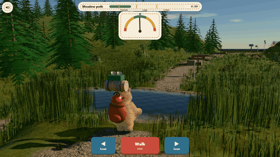
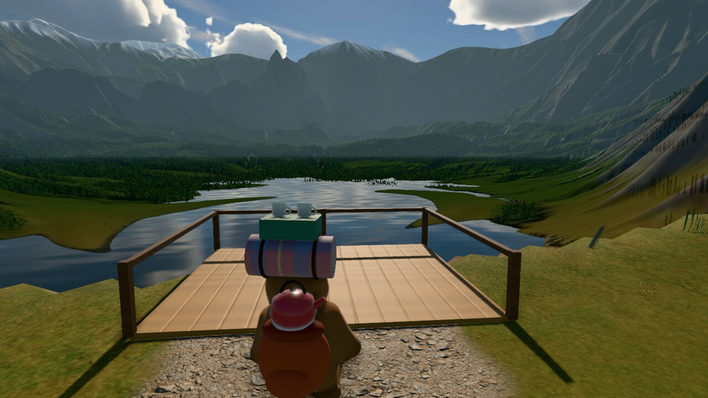
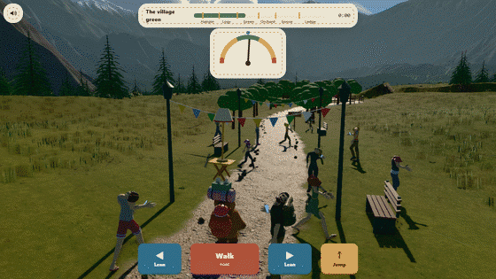
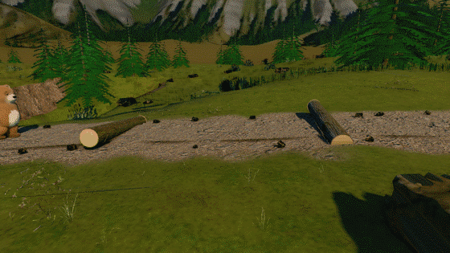

<div align="center">


<p>
  <a href="https://06-bearly-prepared.williamking.workers.dev"></a>
  
  
  
  
  
  
  
</p>

**A furry bear packs a kettle, a folding chair and a standard lamp for a short hike. You have to keep the whole teetering stack on its back all the way to a civilised cup of tea above an alpine lake. The way goes through a pond, over a hillside and fallen logs, past a crowd glued to their phones, under low orchard boughs and away from a very cross goose.**


</div>

## How to play

Pack the stack, then walk it up the trail. Leaning pushes the load the way you lean, so when the gauge tips right, lean left.

| Action | Keyboard | Touch or mouse |
| --- | --- | --- |
| Walk (hold) | <kbd>W</kbd> / <kbd>↑</kbd> | Hold **Walk** |
| Jump | <kbd>Space</kbd> | **⤒ Jump** |
| Lean left | <kbd>A</kbd> / <kbd>←</kbd> | Hold **◀ Lean** |
| Lean right | <kbd>D</kbd> / <kbd>→</kbd> | Hold **Lean ▶** |
| Pack, reorder, fetch | <kbd>Tab</kbd> + <kbd>Enter</kbd> | Tap the item, ▲ ▼, or **Fetch** |
| Mute | <kbd>M</kbd> | Speaker button, top left |

The gauge is green while nothing slides, amber while the loosest piece is slipping and red at the topple edge. Spilled items wait in the grass under a marker; fetching one costs a few seconds, and a topple sends you back to the last flag with the load you had there.

On the hillside, lean uphill. Jump the logs with a run-up, or trip over them. On the green, wait for a gap: nobody there looks up from their phone. In the orchard, lean the stack away from the low boughs. On Goose Lane, do not stop.

## What's inside

- **A bear with real fur.** A continuous sculpted body built in a worker as the page loads, wearing 26 layers of shell fur: strands that lie along the grain, gather into clumps, catch the light along their length and bend in the ledge's gusts. Big dark eyes with lids that blink, brows that worry, a leather nose.
- **A walk with weight in it.** Feet plant and roll, knees bend, the hips bob and shift over each step, the shoulders counter-swing and the arms swing against the legs. Ears, belly and tail follow through on springs, and a heavy load crouches and widens the waddle.
- **A pond to wade through.** The trail runs straight through a reedy meadow pond. The bear sinks to its belly, ripples ring out from every step, and it climbs out dark and dripping. A moment later it shakes itself off in a burst of spray and a frizz of fur, then dries from the top down, faster in the ledge wind.
- **A load you can read.** Weight, height and order change how the stack sways: heavy and low is steady, a lamp on top is magnificently unwise, and anything on the blanket grips better.
<p align="center"></p>

<p align="center"></p>

<table>
  <tr>
    <td width="50%" valign="top"></td>
    <td width="50%" valign="top"></td>
  </tr>
  <tr>
    <td align="center"><sub>The village green: nobody looks up</sub></td>
    <td align="center"><sub>One clean jump, one faceplant</sub></td>
  </tr>
</table>

- **A valley rendered on a GPU, offline.** The mountains were grown in two steps: tectonic uplift against river erosion, then 60 million raindrops of droplet erosion on an RTX 2060 (CUDA, through NVIDIA Warp). The sky is an 8K panorama of cumulus, path-traced through the game's own atmosphere. Sun, sky light, bounce and cloud shadows are baked into the land. The game streams the result as compact textures, so the view costs almost nothing to draw. See [`tools/bake/`](tools/bake/README.md).
- **Seven stretches, each with its own trouble:**
  - a hillside that tips the load downhill;
  - a hairpin that flings it outward;
  - logs to jump, or faceplant over while the whole load carries on without you;
  - a pond to wade;
  - a village green of fourteen people glued to their phones;
  - an orchard whose low boughs catch a tall stack;
  - Goose Lane, where a goose wakes, honks and chases you, pecking, and steals the biscuits from anyone who dawdles.

  The ledge at the end has a windsock and wind streaks that warn before every gust.
- **Physical comedy with fair warnings.** Pieces lag, slide and teeter on the edge before they go; the bear glances up, reaches for them and throws its arms up when something tumbles into the grass.
- **Recoverable mistakes.** Fetch spills for a few seconds each; checkpoint flags remember your load so one silly topple never erases the run.
- **A finale built from what arrived.** The bear sits, the kettle pours and the camera turns to the valley: a neat cup, a respectable picnic or an elaborate little lounge. Missing biscuits get a moment of silence.
- **Sound that follows the load.** Footsteps on every footfall of the walk, splashes in the pond and a lapping bed as you near it, a shake-off, creaks as things start to slide, a thump for every spill, wind that swells before each gust, and synthesised whistles, honks, phone pings, rustles and thuds.
- **Plays anywhere.** Desktop and phone layouts, mouse, touch and keyboard, visible focus, and `prefers-reduced-motion` respected.

<table>
  <tr>
    <td width="68%" valign="top"></td>
    <td width="32%" valign="top"></td>
  </tr>
  <tr>
    <td align="center"><sub>Desktop, 1440 × 900: the hairpin with a lamp on top</sub></td>
    <td align="center"><sub>Phone, 390 × 844</sub></td>
  </tr>
</table>

## Built with

three.js 0.186 (used directly, no React Three Fiber), React 19, strict TypeScript, Vite, GSAP, Tailwind CSS 4, Biome, Bun and Playwright. The bear, props, pond, village, orchard and goose are authored in code. The meadow wears CC0 scans from Poly Haven, the villagers are CC0 characters by Quaternius, and the sounds are CC0 (see Credits). The vista was rendered offline with NVIDIA Warp (CUDA) and Bun.

- **Load and balance model.** The stack is an inverted pendulum about the bear's hips: its mass, centre-of-mass height and inertia come from what you packed and in what order. Corners, logs and gusts add torque, your lean shifts the hips, and each piece slides once the tilt passes its own grip. The rules are pure TypeScript in `src/game/`, unit-tested and simulated headlessly to tune difficulty.
- **Stack-first follow camera.** A three-quarter camera sits close over one shoulder so the stack fills the frame, blends toward where the path is heading so obstacles are seen early, and swings out over the drop on the ledge.
- **A procedural furred character.** The body is a signed-distance sculpt meshed by surface nets in a Web Worker, skinned to a 19-bone rig by the sculpt's own part fields, and painted with fur length, colour and comb direction per vertex (`src/scene/bear-body.ts`). The fur is a shell shader over `MeshPhysicalMaterial` (`src/scene/fur.ts`): a bind-space strand lattice, clumping, Kajiya-Kay glints, self-occlusion, and distance filtering so it never sparkles. Wet fur darkens, clumps into points and lies flat.
- **One lighting model.** A physical sky and a sun in lux, aerial perspective that thins with height and glows toward the sun, GTAO, thresholded bloom, Neutral tone mapping and SMAA. The baked sky panorama is also the environment light, so reflections on the lake match the clouds. Scanned turf, rocky trail, rock and bark. Scanned grass clumps, sorrel, ferns and flowers by the path, grass cards beyond, and firs that bend in the gusts.
- **The rules decide, the scene obeys.** Crowd routes, branch heights, the goose's chase, jumps and log collisions are pure functions in `src/game/`. The villagers stand exactly where the rules put them, and the browser test jumps the logs like a player and checks it never tripped.
- **Adaptive quality.** When frames run long, GTAO goes first, then the fur thins, then resolution drops. Phones get fewer fur shells and a coarser body from the start.

## Run it locally

```sh
bun install
bun run dev      # http://127.0.0.1:4516/
bun run check    # strict tsc, Biome, bun test, production build into dist/
bun run e2e      # Playwright: full hike plus input, touch, motion and startup regressions
```

The end-to-end suite builds and serves the preview, drives a sensible load through the whole hike and checks held controls, three touch layouts, live motion preferences and startup recovery. Use `E2E_GPU=1 bun run e2e` on a machine with a GPU; set `REQUIRE_REAL_GPU=1` to assert the NVIDIA renderer. Software rendering of the furred bear and scanned meadow runs far below real time. Browser tests stay out of `bun run check`; set `PLAYWRIGHT_CHROMIUM` to use a specific Chromium binary.

For visual work, `lookdev.html` on the dev server is a look-dev harness with the game's exact lighting (the bear on a turntable beside grey and mirror spheres and a colour chart), and `tools/batch/` renders look-dev sheets and deterministic gameplay films on the GPU.

Source layout: `src/game/` rules and state, `src/scene/` three.js scene, `src/audio/` sound, `src/ui/` React HUD, `src/main.tsx` wiring.

## Credits

The bear, props, pond and trail are authored procedurally in this repository. Libraries: three.js, React, GSAP and Tailwind CSS, each under its own licence. Every sourced file is listed with its hash and processing in `assets.manifest.json`.

Visual assets (all CC0 1.0, from [Poly Haven](https://polyhaven.com)):

| Files | Source |
| --- | --- |
| `textures/grass_ground`, `rocky_trail`, `rock_face_03` | [grass ground](https://polyhaven.com/a/grass_ground), [rocky trail](https://polyhaven.com/a/rocky_trail), [rock face 03](https://polyhaven.com/a/rock_face_03) |
| `textures/bark_brown_02`, `distressed_painted_planks`, `hessian_230`, `wool_boucle` | [bark brown 02](https://polyhaven.com/a/bark_brown_02), [distressed painted planks](https://polyhaven.com/a/distressed_painted_planks), [hessian 230](https://polyhaven.com/a/hessian_230), [wool boucle](https://polyhaven.com/a/wool_boucle) |
| `textures/grass_medium_02` and `shrub_02` card atlases | [grass medium 02](https://polyhaven.com/a/grass_medium_02), [shrub 02](https://polyhaven.com/a/shrub_02) |
| `models/rock_moss_set_01.glb`, `models/dandelion_01.glb` | [rock moss set 01](https://polyhaven.com/a/rock_moss_set_01), [dandelion 01](https://polyhaven.com/a/dandelion_01) |
| `models/veg/*.glb` and `textures/veg/*` (welded, compressed, alpha merged) | [grass medium 01](https://polyhaven.com/a/grass_medium_01), [grass medium 02](https://polyhaven.com/a/grass_medium_02), [grass bermuda 01](https://polyhaven.com/a/grass_bermuda_01), [shrub sorrel 01](https://polyhaven.com/a/shrub_sorrel_01), [fern 02](https://polyhaven.com/a/fern_02), [flower heliophila](https://polyhaven.com/a/flower_heliophila), [moss 01](https://polyhaven.com/a/moss_01) |

Characters (CC0 1.0): `models/people/*.glb`, fourteen villagers and their shared animation clips, from Quaternius's [Ultimate Modular Characters](https://quaternius.com/packs/ultimatemodularcharacters.html) and [Ultimate Modular Women](https://quaternius.com/packs/ultimatemodularwomen.html), re-exported with meshopt compression.

The vista (`public/vista/`) is original: rendered by this repository's `tools/bake/` from its own designed land.

Audio (all CC0 1.0, https://creativecommons.org/publicdomain/zero/1.0/; trimmed, looped and
re-encoded to MP3 for this project):

| Files in `public/audio/` | Source | Author | Licence |
| --- | --- | --- | --- |
| `step-*`, `kettle-*`, `teacups-*`, `biscuits-*`, `blanket-*`, `chair-*`, `lamp-*`, `log-*`, `topple-*` | [Impact Sounds](https://kenney.nl/assets/impact-sounds) | Kenney (kenney.nl) | CC0 |
| `creak-*`, `cloth-*` | [RPG Audio](https://kenney.nl/assets/rpg-audio) | Kenney (kenney.nl) | CC0 |
| `ui-*`, `flag-0`, `silence-0` | [Interface Sounds](https://kenney.nl/assets/interface-sounds) | Kenney (kenney.nl) | CC0 |
| `jingle-start`, `jingle-tea` | [Music Jingles](https://kenney.nl/assets/music-jingles) (Pizzicato 10 and 03) | Kenney (kenney.nl) | CC0 |
| `music-picnic` | [Children's Game Music 1 – Picnic](https://opengameart.org/content/childrens-game-music-1-picnic) | heartade | CC0 |
| `amb-birds`, `amb-wind` | [Park ambiences](https://opengameart.org/content/park-ambiences) (birds, wind) | Thimras | CC0 |
| `splash-*`, `amb-water`, `shake-0` (with Kenney's cloth flutters) | [40 CC0 water / splash / slime SFX](https://opengameart.org/content/40-cc0-water-splash-slime-sfx) | Rubberduck | CC0 |

---

<p align="center"><sub>Part of William King's portfolio collection</sub></p>
