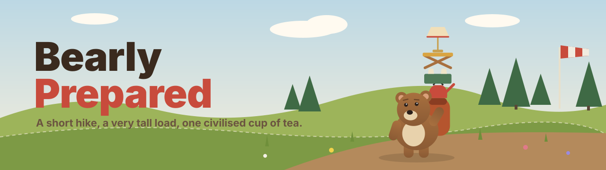
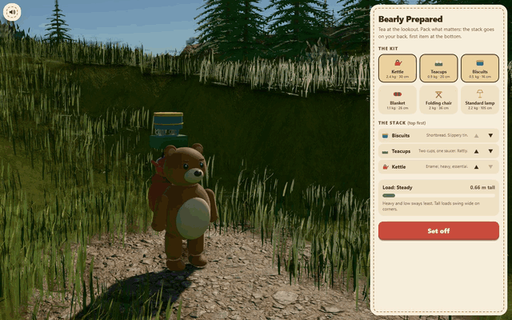
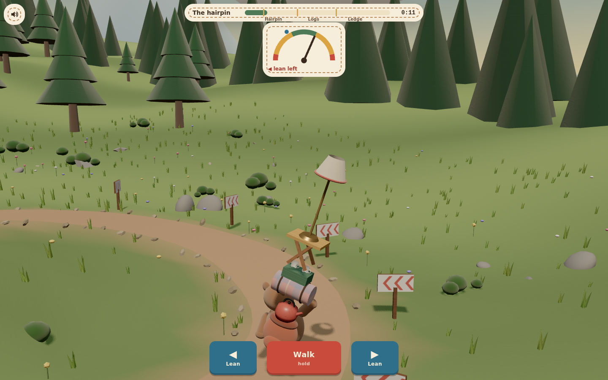
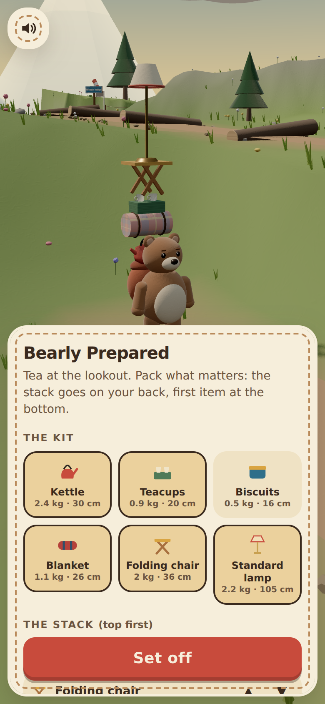

<div align="center">



<p>
  <a href="https://06-bearly-prepared.williamking.workers.dev"></a>
  
  
  
  
  
  
  
</p>

**A felt bear packs a kettle, a folding chair and a standard lamp for a very short hike, and you have to keep the whole teetering stack on its back all the way to a civilised cup of tea.**



</div>

## How to play

Pack the stack, then walk it up the trail. Leaning pushes the load the way you lean, so when the gauge tips right, lean left.

| Action | Keyboard | Touch or mouse |
| --- | --- | --- |
| Walk (hold) | <kbd>W</kbd> / <kbd>↑</kbd> / <kbd>Space</kbd> | Hold **Walk** |
| Lean left | <kbd>A</kbd> / <kbd>←</kbd> | Hold **◀ Lean** |
| Lean right | <kbd>D</kbd> / <kbd>→</kbd> | Hold **Lean ▶** |
| Pack, reorder, fetch | <kbd>Tab</kbd> + <kbd>Enter</kbd> | Tap the item, ▲ ▼, or **Fetch** |
| Mute | <kbd>M</kbd> | Speaker button, top left |

The gauge is green while nothing slides, amber while the loosest piece is slipping and red at the topple edge. Spilled items wait in the grass under a marker; fetching one costs a few seconds, and a topple sends you back to the last flag with the load you had there.

## What's inside

- **A load you can read.** Weight, height and order change how the stack sways: heavy and low is steady, a lamp on top is magnificently unwise, and anything on the blanket grips better.
- **Three authored obstacles.** A signposted hairpin that flings the load outward, a log crossing that lurches it toward each log's low end, and a cliff ledge where the windsock and wind streaks warn you before every gust.
- **Physical comedy with fair warnings.** Pieces lag, slide and teeter on the edge before they go; the bear glances up, reaches for them and throws its arms up when something tumbles into the grass.
- **Recoverable mistakes.** Fetch spills for a few seconds each; checkpoint flags remember your load so one silly topple never erases the run.
- **A finale built from what arrived.** The bear sits, the kettle pours and the camera turns to the valley: a neat cup, a respectable picnic or an elaborate little lounge. Missing biscuits get a moment of silence.
- **Sound that follows the load.** Footsteps in step with the walk, creaks as things start to slide, a thump for every spill, wind that swells before each gust and a synthesised kettle whistle.
- **Plays anywhere.** Desktop and phone layouts, mouse, touch and keyboard, visible focus, and `prefers-reduced-motion` respected.

<table>
  <tr>
    <td width="68%" valign="top"></td>
    <td width="32%" valign="top"></td>
  </tr>
  <tr>
    <td align="center"><sub>Desktop, 1440 × 900: the hairpin with a lamp on top</sub></td>
    <td align="center"><sub>Phone, 390 × 844: packing</sub></td>
  </tr>
</table>

## Built with

three.js 0.186 (used directly, no React Three Fiber), React 19, strict TypeScript, Vite, GSAP, Tailwind CSS 4, Biome, Bun and Playwright. Every mesh, material and texture is authored procedurally in code; the only assets are CC0 sounds.

- **Load and balance model.** The stack is an inverted pendulum about the bear's hips: its mass, centre-of-mass height and inertia come from what you packed and in what order. Corners, logs and gusts add torque, your lean shifts the hips, and each piece slides once the tilt passes its own grip. The rules are pure TypeScript in `src/game/`, unit-tested and simulated headlessly to tune difficulty.
- **Stack-first follow camera.** A three-quarter camera sits close over one shoulder so the stack fills the frame, blends toward where the path is heading so obstacles are seen early, and swings out over the drop on the ledge.
- **Felt, wood and meadow in code.** Physical sheen felt with fibre bump maps, painted-wood grain and tartan painted into small canvases, AgX tone mapping, instanced grass that bends in a small vertex shader and leans with each gust.

## Run it locally

```sh
bun install
bun run dev      # http://127.0.0.1:4516/
bun run check    # strict tsc, Biome, bun test, production build into dist/
bun run e2e      # Playwright: packs a sensible load and walks it to the lookout
```

The end-to-end test builds and serves the preview, then drives headless Chromium (SwiftShader is fine; about 1.5 minutes on a GPU, 3 to 4 in software). It stays out of `bun run check` because it needs a browser; set `PLAYWRIGHT_CHROMIUM` to use a specific Chromium binary.

Source layout: `src/game/` rules and state, `src/scene/` three.js scene, `src/audio/` sound, `src/ui/` React HUD, `src/main.tsx` wiring.

## Credits

Everything visual is authored procedurally in this repository. Libraries: three.js, React, GSAP and Tailwind CSS, each under its own licence.

Audio (all CC0 1.0, https://creativecommons.org/publicdomain/zero/1.0/; trimmed, looped and
re-encoded to MP3 for this project):

| Files in `public/audio/` | Source | Author | Licence |
| --- | --- | --- | --- |
| `step-*`, `kettle-*`, `teacups-*`, `biscuits-*`, `blanket-*`, `chair-*`, `lamp-*`, `log-*`, `topple-*` | [Impact Sounds](https://kenney.nl/assets/impact-sounds) | Kenney (kenney.nl) | CC0 |
| `creak-*`, `cloth-*` | [RPG Audio](https://kenney.nl/assets/rpg-audio) | Kenney (kenney.nl) | CC0 |
| `ui-*`, `flag-0`, `silence-0` | [Interface Sounds](https://kenney.nl/assets/interface-sounds) | Kenney (kenney.nl) | CC0 |
| `jingle-start`, `jingle-tea` | [Music Jingles](https://kenney.nl/assets/music-jingles) (Pizzicato 10 and 03) | Kenney (kenney.nl) | CC0 |
| `music-picnic` | [Children's Game Music 1 – Picnic](https://opengameart.org/content/childrens-game-music-1-picnic) | heartade | CC0 |
| `amb-birds`, `amb-wind` | [Park ambiences](https://opengameart.org/content/park-ambiences) (birds, wind) | Thimras | CC0 |

---

<p align="center"><sub>Part of William King's portfolio collection</sub></p>
